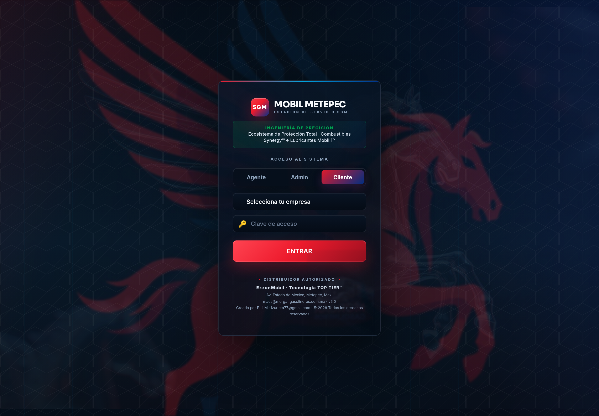
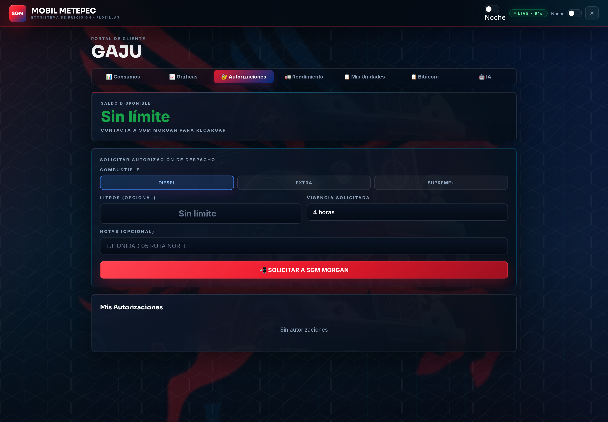
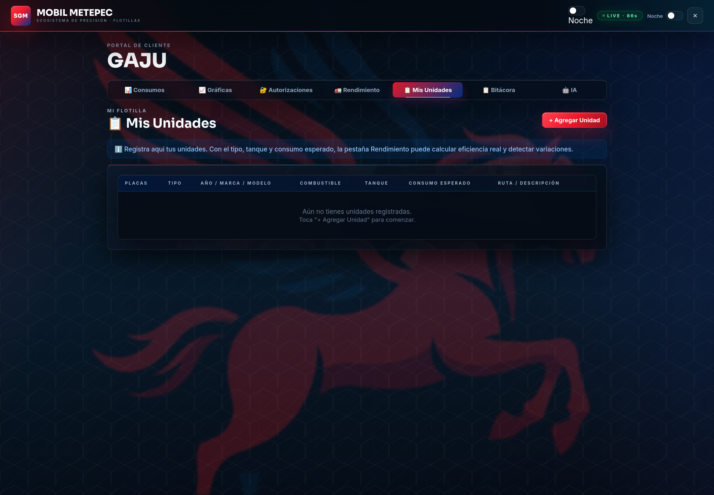
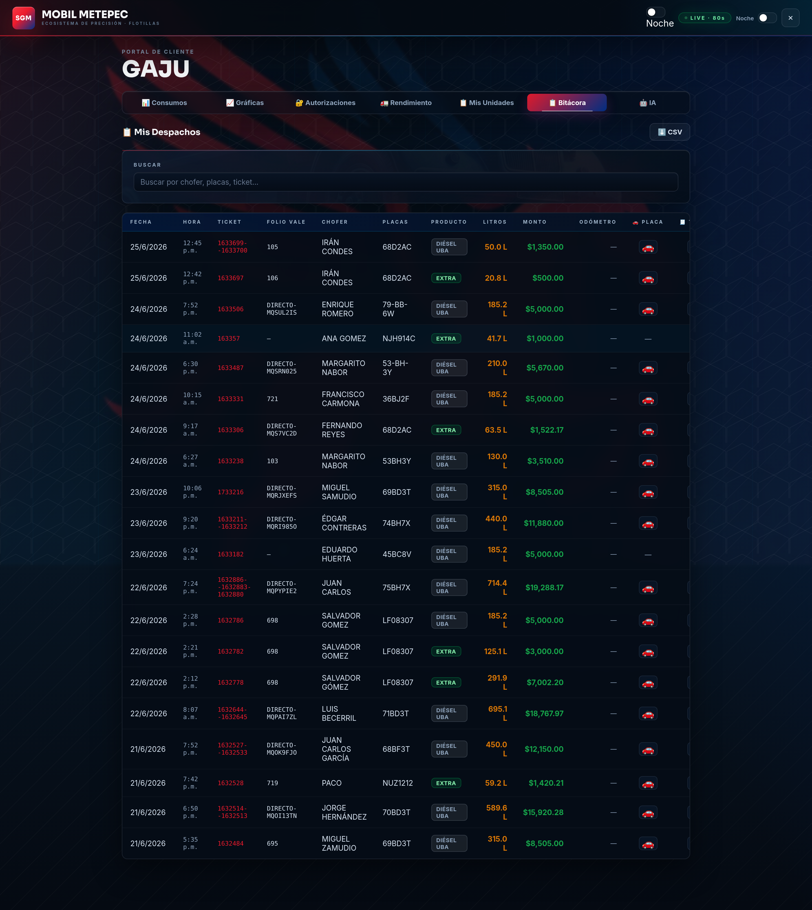
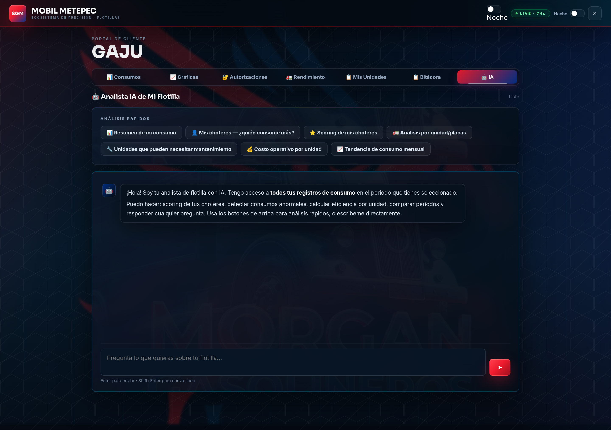
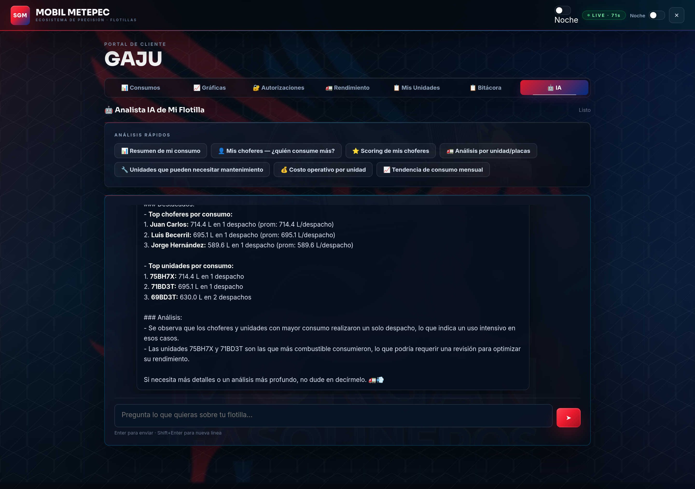

# 🛡️ App SGM Mobil Metepec — Guía Completa de Beneficios para Clientes

### Ecosistema de Precisión · Combustibles Synergy™ + Lubricantes Mobil 1™ · Distribuidor Autorizado ExxonMobil

> **¿Qué es esto?** Cada cliente que carga combustible con nosotros en **SGM Mobil
> Metepec** recibe un **Portal de Cliente digital** gratuito. Es una aplicación web
> (se abre desde el celular o la computadora, sin instalar nada) donde puedes ver
> **en tiempo real** todo lo que tu flotilla consume con nosotros: litros, montos,
> choferes, unidades, rendimiento, gráficas y hasta un **analista con Inteligencia
> Artificial** que responde tus preguntas.
>
> Este documento explica **todas las funciones y beneficios**, con **capturas de
> pantalla reales** tomadas con la cuenta del cliente **GAJU**.

---

## 📲 Cómo se accede

- **Dirección:** `https://appsgm.netlify.app`
- **Entras como "Cliente"**, eliges el nombre de tu empresa y escribes tu **clave de
  acceso** (ejemplo del cliente de muestra: empresa *GAJU*, clave *GAJ2026*).
- Funciona desde **cualquier dispositivo** (celular, tablet, PC). No se instala nada.
- Tus datos viajan **cifrados** y la clave se valida en un **servidor seguro** — no
  está escrita en la página, así que nadie puede verla.
- La sesión se mantiene **24 horas** y los datos se **actualizan solos cada par de
  minutos** (verás el indicador `LIVE` arriba a la derecha).

**Beneficio:** acceso inmediato, seguro y sin costo. Solo tú ves la información de
**tu** empresa; ningún otro cliente puede ver tus datos.

---

## 🧭 El Portal por dentro — 7 secciones

Una vez dentro, tu nombre aparece arriba (ej. **GAJU**) y tienes **7 pestañas**:

| Pestaña | Para qué sirve |
|---|---|
| 📊 **Consumos** | Resumen general y tabla de todos tus despachos |
| 📈 **Gráficas** | Visualizaciones de tu consumo (choferes, unidades, productos, tendencia) |
| 🔐 **Autorizaciones** | Pide y administra autorizaciones de carga con código QR |
| 🚛 **Rendimiento** | Eficiencia real de cada unidad (km/L, $/km) |
| 📋 **Mis Unidades** | Registra tu flotilla (tipo, tanque, consumo esperado) |
| 📋 **Bitácora** | Buscador y exportación de todos los despachos a Excel/CSV |
| 🤖 **IA** | Analista con Inteligencia Artificial de tu flotilla |

A continuación, cada una a detalle.

---

## 1) 📊 Consumos — Tu panorama completo

Es la pantalla principal. De un vistazo ves **cuánto has cargado, cuánto has gastado
y cuántos despachos** llevas en el período.

**Lo que muestra:**

- **Indicadores (KPIs) grandes arriba:** total de **litros**, **monto total en pesos**
  y **número de despachos**. (En la captura: *5,252.0 litros · $139,991.00 · 20
  despachos*).
- **Filtro por período:** eliges *Desde* y *Hasta* y todo el portal se recalcula para
  esas fechas.
- **Consumo por Chofer** (barras rojas) y **Consumo por Unidad** (barras azules):
  ranking de quién y qué unidad consume más.
- **Tabla "Mis Despachos":** cada carga con **Fecha, Hora, Ticket, Folio de Vale,
  Chofer, Placas, Producto, Litros, Monto y Odómetro**, además de íconos para ver la
  **foto de la placa**, la **foto del ticket** y la **firma** de quien recibió.

**Beneficios:**

- Sabes **al instante** cuánto llevas gastado sin pedir reportes ni esperar al corte.
- Detectas **quién consume de más** y qué unidad se sale del patrón.
- Cada despacho tiene **respaldo fotográfico** (placa, ticket y firma): control
  antifraude total.

---

## 2) 📈 Gráficas — Tu consumo en imágenes

Seis gráficas profesionales que convierten tus números en información fácil de leer.

**Lo que muestra:**

- **Mis Choferes (Top 10)** y **Mis Unidades (Top 10)** por litros.
- **Mix de Productos:** dona con la distribución entre **Diésel, Extra, Supreme+**.
- **Tendencia Diaria:** litros por día — ves picos y caídas de actividad.
- **Gasto por Chofer ($MXN):** cuánto dinero representa cada operador.
- **Eficiencia de Carga:** litros promedio por despacho.

**Beneficios:**

- Entiendes tu operación **sin saber de números**: todo es visual.
- Ideal para **juntas y reportes** a dirección — se ve claro y presentable.
- Identificas **estacionalidad** y planeas mejor tus recargas.

---

## 3) 🔐 Autorizaciones — Carga controlada con QR

Aquí controlas **quién puede cargar y cuánto**, sin entregar efectivo ni vales de
papel.

**Lo que muestra y permite:**

- **Saldo disponible** de tu cuenta (o *"Sin límite"* si así está configurado).
- **Solicitar una autorización de despacho**, eligiendo:
  - **Combustible:** Diésel / Extra / Supreme+.
  - **Litros** (un tope, o abierto sin límite).
  - **Vigencia:** 4 h, 8 h, 1 día, 3 días o mensual.
  - **Notas** (ej. *"UNIDAD 05 RUTA NORTE"*).
- Al solicitar, se genera un **código y un QR** que el chofer presenta en la estación
  para cargar **exactamente lo autorizado**.
- Lista de **tus autorizaciones activas** con su estado y hora de vencimiento.

**Beneficios:**

- **Cero efectivo en manos del chofer:** autorizas desde tu celular.
- Control fino: pones **límite de litros, producto y tiempo**.
- El **QR evita errores y cargas no autorizadas**: solo carga quien tú dijiste.

---

## 4) 🚛 Rendimiento — Eficiencia real de cada unidad

La sección más potente para **ahorrar dinero**: calcula cuántos **kilómetros por
litro** rinde de verdad cada unidad y **cuánto te cuesta cada kilómetro**.

**Lo que muestra:**

- **Tabla por unidad:** Placas, Tipo, Litros, km capturados, **km/L real**, **km/L
  objetivo**, **$/km** y un **estado** (si va bien o por debajo de lo esperado).
- **Rendimiento por Chofer:** despachos, total de litros, litros por despacho,
  unidades que maneja y su último despacho.
- **Registrar km del período:** capturas los kilómetros recorridos (directo, **sin
  necesidad de odómetro**; el odómetro es opcional). Eliges tipo de ruta (urbana,
  carretera, mixta, montaña…), tipo de operación, nivel de carga y observaciones.
- **Resumen en vivo:** mientras escribes, calcula **km/L, $/km, % vacío y litros del
  período** al instante, y te compara contra el rendimiento esperado de la unidad.
- **Historial de cierres operativos** para comparar período contra período.

**Beneficios:**

- Descubres **qué unidad se está "comiendo" el combustible** y cuál va eficiente.
- Mides el **costo real por kilómetro** — clave para cotizar fletes y cuidar margen.
- Detectas a tiempo **fallas mecánicas** (cuando una unidad baja su km/L habitual).

---

## 5) 📋 Mis Unidades — El catálogo de tu flotilla

Registras cada vehículo con su ficha técnica para que el sistema calcule rendimiento
con precisión.

**Lo que muestra y permite:**

- Botón **"+ Agregar Unidad"** para dar de alta cada vehículo.
- Por unidad: **Placas, Tipo, Año / Marca / Modelo, Combustible, Capacidad de tanque,
  Consumo esperado y Ruta / Descripción**.

**Beneficios:**

- Al definir el **consumo esperado**, la pestaña *Rendimiento* puede **comparar lo
  real contra lo ideal** y avisarte de desviaciones.
- Tienes el **inventario de tu flotilla ordenado** y siempre a la mano.

---

## 6) 📋 Bitácora — Buscador y exportación

El historial completo de despachos, con buscador y descarga a Excel/CSV.

**Lo que muestra y permite:**

- **Buscador** por chofer, placas o ticket: encuentras cualquier carga en segundos.
- Misma tabla detallada de despachos (fecha, hora, ticket, folio, chofer, placas,
  producto, litros, monto, odómetro) con **fotos de placa, ticket y firma**.
- Botón **⬇️ CSV** para **descargar todo a Excel** y trabajarlo en tu contabilidad.

**Beneficios:**

- **Auditoría instantánea:** ¿pagaste de más? Lo compruebas con foto y firma.
- Integras los datos a tu **contabilidad o ERP** con un clic.
- Respaldo permanente de **cada operación**.

---

## 7) 🤖 IA — Tu analista de flotilla con Inteligencia Artificial

Un asistente que **lee todos tus datos** y responde en lenguaje normal, como si
tuvieras un analista dedicado.

**Análisis rápidos con un botón:**

- 📊 Resumen de mi consumo
- 👤 Mis choferes — ¿quién consume más?
- ⭐ Scoring (calificación) de mis choferes
- 🚛 Análisis por unidad / placas
- 🔧 Unidades que pueden necesitar mantenimiento
- 💰 Costo operativo por unidad
- 📈 Tendencia de consumo mensual

También puedes **escribirle cualquier pregunta** sobre tu flotilla.

### La IA en acción

Al pedir *"Resumen de mi consumo"*, responde con datos concretos y recomendaciones:

En el ejemplo, la IA identificó los **choferes y unidades que más consumen**, detectó
que varias cargas fueron de **uso intensivo en un solo despacho** y **recomendó
revisar las unidades de mayor consumo** para optimizar rendimiento.

**Beneficios:**

- Obtienes **conclusiones y recomendaciones**, no solo números.
- Detecta **consumos anormales y posibles mantenimientos** antes de que sean un
  problema caro.
- Es como tener un **analista 24/7** sin contratar a nadie.

---

## ✅ Resumen de beneficios — ¿Por qué cargar con nosotros?

| Beneficio | Qué ganas |
|---|---|
| **Transparencia total** | Ves cada litro, peso, chofer y unidad en tiempo real |
| **Respaldo antifraude** | Foto de placa, foto de ticket y firma en cada despacho |
| **Control de gasto** | KPIs y gráficas claras; sabes cuánto llevas sin esperar al corte |
| **Autorizaciones con QR** | Cargas sin efectivo, con límite de litros, producto y vigencia |
| **Ahorro real** | Rendimiento km/L y costo $/km por unidad para cuidar tu margen |
| **Mantenimiento preventivo** | Detectas unidades que bajan su eficiencia (posible falla) |
| **Productividad** | Buscador instantáneo y exportación a Excel/CSV |
| **Inteligencia Artificial** | Un analista que interpreta tus datos y te recomienda acciones |
| **Acceso seguro** | Clave validada en servidor; solo tú ves tu información |
| **Sin costo y sin instalar** | Funciona en cualquier celular o PC, gratis para clientes |

---

## 🔒 Seguridad y privacidad

- Tu **clave se valida en un servidor seguro**, no está visible en la página.
- La conexión usa **cifrado HTTPS** y protecciones contra ataques comunes.
- **Cada cliente solo ve sus propios datos** — están separados por empresa.
- La información se respalda en la nube y se **actualiza automáticamente**.

---

## 🚀 Cómo empezar

1. Pídenos tu **clave de acceso** (la creamos para tu empresa).
2. Entra a **`https://appsgm.netlify.app`** → pestaña **Cliente**.
3. Elige tu empresa, escribe tu clave y **listo**: ya ves toda tu flotilla.
4. ¿Dudas? Te acompañamos a configurar tus unidades y autorizaciones.

> **SGM Mobil Metepec** · Av. Estado de México, Metepec, Méx. · contacto@sgmmobil.com
> Distribuidor Autorizado ExxonMobil · Tecnología TOP TIER™ · App v3.0

---

*Documento generado con capturas reales del portal del cliente GAJU. Las cifras
mostradas corresponden al período de demostración y cambian según tus cargas reales.*
