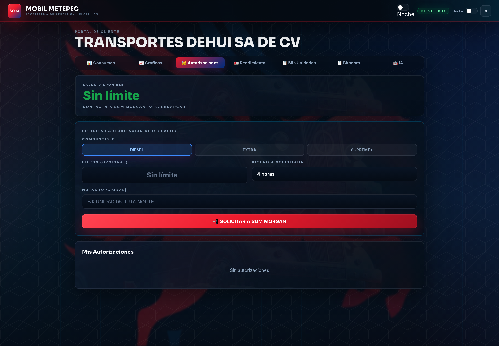
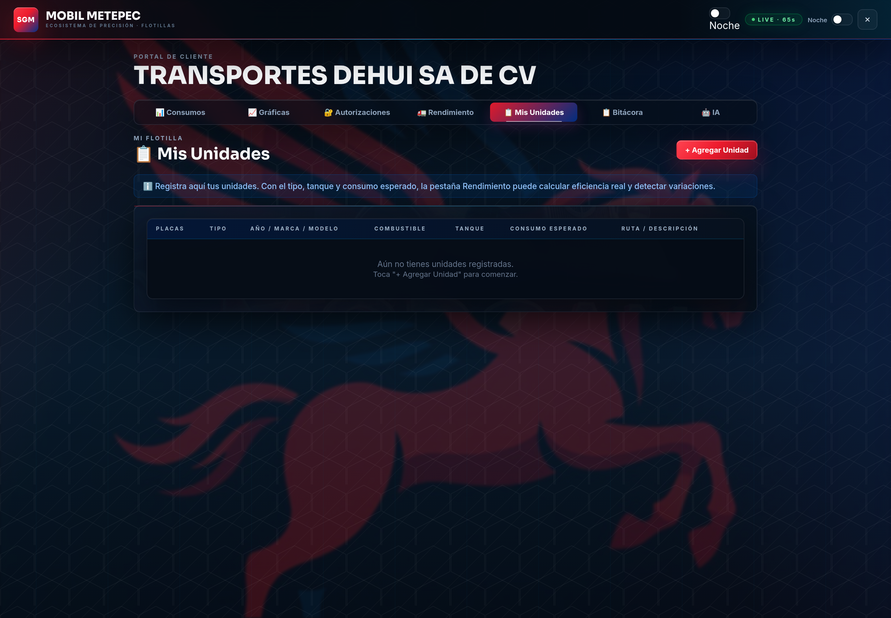
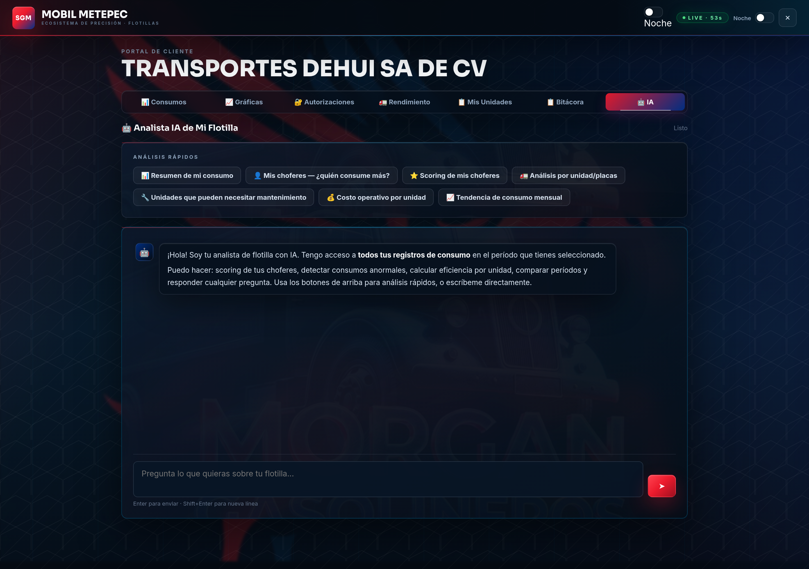
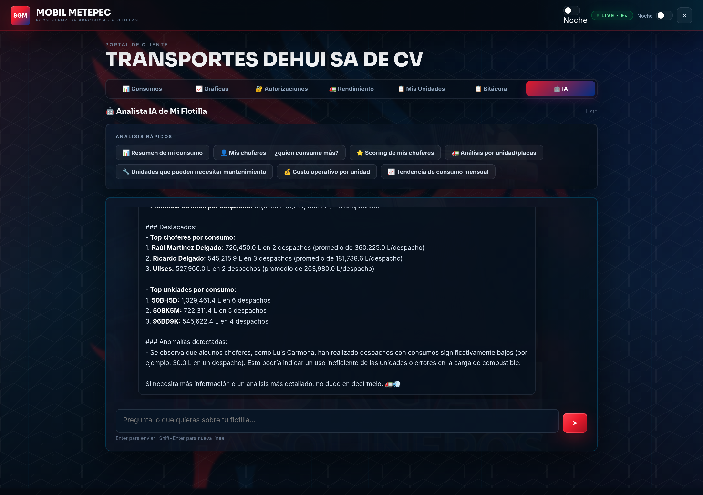

# 🛡️ App SGM Mobil Metepec — Guía Completa de Beneficios · Cliente TRANSPORTES DEHUI

### Ecosistema de Precisión · Combustibles Synergy™ + Lubricantes Mobil 1™ · Distribuidor Autorizado ExxonMobil

> **Para TRANSPORTES DEHUI SA DE CV.** Como cliente de flotilla de **SGM Mobil
> Metepec**, tienes un **Portal de Cliente digital** gratuito donde ves **en tiempo
> real** todo lo que tu flotilla consume con nosotros: despachos, montos, choferes,
> unidades, rendimiento, gráficas y un **analista con Inteligencia Artificial**.
>
> Este documento explica **todas las funciones y beneficios**, con **capturas de
> pantalla reales** tomadas con la cuenta de **DEHUI**.

---

## 📲 Cómo se accede

- **Dirección:** `https://appsgm.netlify.app`
- Entras como **Cliente**, eliges **TRANSPORTES DEHUI** y escribes tu **clave de
  acceso**.
- Funciona desde **cualquier dispositivo** (celular, tablet, PC). No se instala nada.
- La clave se valida en un **servidor seguro** (no está escrita en la página) y la
  sesión se **actualiza sola** (indicador `LIVE`).

**Beneficio:** acceso inmediato, seguro y sin costo. Solo tú ves la información de
**DEHUI**; ningún otro cliente puede verla.

---

## 1) 📊 Consumos — Tu panorama completo

Pantalla principal. De un vistazo ves **cuánto has cargado, cuánto has gastado y
cuántos despachos** llevas en el período. En la cuenta de DEHUI se observa una
operación intensa: **48 despachos** y **$543,376.59 facturados** en el período
consultado, con una flotilla amplia de unidades y choferes.

**Lo que muestra:**

- **Indicadores (KPIs) grandes:** total de **litros**, **monto total en pesos** y
  **número de despachos**.
- **Filtro por período** (*Desde / Hasta*) que recalcula todo el portal.
- **Consumo por Chofer** y **Consumo por Unidad** (rankings).
- **Tabla "Mis Despachos":** cada carga con **Fecha, Hora, Ticket, Folio de Vale,
  Chofer, Placas, Producto, Litros, Monto y Odómetro**, con **foto de placa, foto de
  ticket y firma**.

**Beneficios:**

- Sabes **al instante** cuánto llevas gastado sin esperar al corte.
- Con una flotilla grande, detectas **quién o qué unidad se sale del patrón**.
- **Respaldo fotográfico** de cada despacho: control antifraude total.

> 💡 **Recomendación para DEHUI:** revisa que la columna de **litros** en tu hoja de
> registros tenga capturas consistentes; algunos despachos muestran valores muy
> elevados que conviene depurar para que el cálculo de litros y km/L sea exacto.

---

## 2) 📈 Gráficas — Tu consumo en imágenes

Seis gráficas profesionales que convierten tus números en información fácil de leer.

**Lo que muestra:**

- **Top 10 Choferes** y **Top 10 Unidades** por litros.
- **Mix de Productos** (Diésel / Extra / Supreme+).
- **Tendencia Diaria** de litros.
- **Gasto por Chofer ($MXN)** y **Eficiencia de Carga** (litros por despacho).

**Beneficios:**

- Entiendes una operación grande **de forma visual**, sin perderte en tablas.
- Ideal para **juntas y reportes** a dirección.
- Identificas **estacionalidad** y planeas tus recargas.

---

## 3) 🔐 Autorizaciones — Carga controlada con QR

Controlas **quién carga y cuánto**, sin efectivo ni vales de papel.

**Permite:**

- Ver tu **saldo disponible**.
- **Solicitar autorización** eligiendo **combustible, litros (o sin límite),
  vigencia** (4 h a mensual) y notas.
- Genera un **código + QR** que el chofer presenta para cargar exactamente lo
  autorizado.
- Lista de **autorizaciones activas** con su vencimiento.

**Beneficios:**

- **Cero efectivo** en manos del chofer: autorizas desde tu celular.
- Límite por **litros, producto y tiempo**.
- El **QR evita errores y cargas no autorizadas** — clave en flotillas grandes.

---

## 4) 🚛 Rendimiento — Eficiencia real de cada unidad

La sección para **ahorrar dinero**: calcula **km/L real** y **costo por kilómetro**
de cada unidad, frente a su objetivo.

**Lo que muestra:**

- **Tabla por unidad:** Placas, Tipo, Litros, km capturados, **km/L real**, **km/L
  objetivo**, **$/km** y **estado** (OK / alerta).
- **Rendimiento por Chofer:** despachos, litros, litros por despacho, unidades y
  último despacho — útil con tu plantilla amplia de operadores.
- **Registrar km del período** (directo, **sin necesidad de odómetro**), con resumen
  en vivo de **km/L, $/km, % vacío y litros**.
- **Historial de cierres** para comparar período contra período.

**Beneficios:**

- Descubres **qué unidad consume de más** entre toda la flotilla.
- Mides el **costo real por kilómetro** — clave para cotizar fletes.
- Detectas **fallas mecánicas** cuando una unidad baja su km/L habitual.

---

## 5) 📋 Mis Unidades — El catálogo de tu flotilla

Registras cada vehículo con su ficha técnica para calcular rendimiento con precisión.

**Por unidad:** Placas, Tipo, Año / Marca / Modelo, Combustible, Capacidad de tanque,
**Consumo esperado** y Ruta / Descripción.

**Beneficios:**

- Con el **consumo esperado**, *Rendimiento* compara lo real contra lo ideal y avisa
  desviaciones.
- Tienes el **inventario de tu flotilla ordenado** y a la mano.

---

## 6) 📋 Bitácora — Buscador y exportación

El historial completo de despachos, con buscador y descarga a Excel/CSV.

**Permite:**

- **Buscador** por chofer, placas o ticket.
- Tabla detallada con **fotos de placa, ticket y firma**.
- Botón **⬇️ CSV** para **descargar todo a Excel**.

**Beneficios:**

- **Auditoría instantánea** de cualquier carga.
- Integras los datos a tu **contabilidad o ERP** con un clic.
- Respaldo permanente de **cada operación**.

---

## 7) 🤖 IA — Tu analista de flotilla con Inteligencia Artificial

Un asistente que **lee todos tus datos** y responde en lenguaje normal.

**Análisis rápidos con un botón:** resumen de consumo, ranking de choferes, **scoring
de choferes**, análisis por unidad, **unidades que pueden necesitar mantenimiento**,
costo por unidad y tendencia mensual. También le escribes cualquier pregunta.

### La IA en acción

Al pedir *"Resumen de mi consumo"*, la IA de DEHUI entregó rankings concretos:
identificó a los **choferes y unidades de mayor consumo** (entre ellos **Raúl
Martínez Delgado**, **Ricardo Delgado** y **Ulises**, y las unidades **50BHSD**,
**50BK5M** y **96BD6K**) y **detectó anomalías** —choferes con consumos atípicos en un
solo despacho— recomendando revisarlos para descartar irregularidades o ineficiencias.

**Beneficios:**

- Obtienes **conclusiones y recomendaciones**, no solo números.
- Detecta **consumos anormales y posibles mantenimientos** antes de que cuesten caro.
- Es como tener un **analista 24/7** sin contratar a nadie.

---

## ✅ Resumen de beneficios para DEHUI

| Beneficio | Qué ganas |
|---|---|
| **Transparencia total** | Ves cada despacho, peso, chofer y unidad en tiempo real |
| **Respaldo antifraude** | Foto de placa, foto de ticket y firma en cada despacho |
| **Control de gasto** | KPIs y gráficas claras; sabes cuánto llevas sin esperar al corte |
| **Autorizaciones con QR** | Cargas sin efectivo, con límite de litros, producto y vigencia |
| **Ahorro real** | Rendimiento km/L y costo $/km por unidad para cuidar tu margen |
| **Mantenimiento preventivo** | Detectas unidades que bajan su eficiencia (posible falla) |
| **Productividad** | Buscador instantáneo y exportación a Excel/CSV |
| **Inteligencia Artificial** | Un analista que interpreta tus datos y recomienda acciones |
| **Acceso seguro** | Clave validada en servidor; solo tú ves tu información |
| **Sin costo y sin instalar** | Funciona en cualquier celular o PC, gratis para clientes |

---

## 🚀 Cómo empezar

1. Pídenos tu **clave de acceso** (la creamos para DEHUI).
2. Entra a **`https://appsgm.netlify.app`** → pestaña **Cliente**.
3. Elige **TRANSPORTES DEHUI**, escribe tu clave y **listo**: ya ves toda tu flotilla.

> **SGM Mobil Metepec** · Av. Estado de México, Metepec, Méx. · contacto@sgmmobil.com
> Distribuidor Autorizado ExxonMobil · Tecnología TOP TIER™ · App v3.0

---

*Documento generado con capturas reales del portal del cliente TRANSPORTES DEHUI. Las
cifras mostradas corresponden al período consultado y cambian según tus cargas
reales.*
